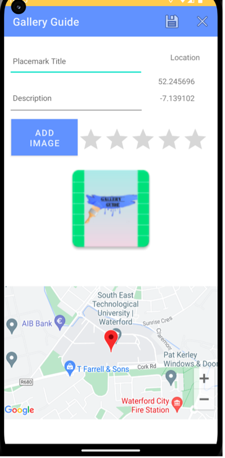

# __Waterford Gallery Guide__

__Waterford Gallery Guide is a native android application built using Kotlin.__
__Final project for HDip in Computer science.__
__It is an all-in-one gallery guide for the city built for tourists/locals in mind who are looking to enjoy the artistic scenes across the county.__

!

## Features
- Add a personal gallery
- Card view in recycler view 
- Edit personal gallery 
- Delete personal gallery spot 
- FireBase storage
- Google Maps Implemented
- User Register / Login / Signout
- Authentication via FireBase

## References
- Implement Barcode QR Scanner -> https://www.youtube.com/watch?v=Gf-bttCyt7c&list=PLN8KRetF_zntkNhZxnIjGl7TjbGO7Egus&index=5
- QR scanner detecting QR code but not redirecting to default browser - https://stackoverflow.com/questions/75595367/android-kotlin-qr-scanner-detecting-qr-code-but-not-redirecting-to-default-bro
- Splash Screen - Android Studio Tutorial - https://www.youtube.com/watch?v=Q0gRqbtFLcw&ab_channel=Stevdza-San
- Rating Bar - https://developer.android.com/reference/android/widget/RatingBar